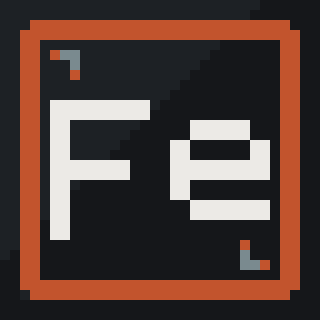

    Этот проект предназначен для удобного и быстрого создания модулей ядра и драйверов под linux.
    В нем будут модули для работы с сетью, символьные драйвера и блочные. Драйвера для работы с железом.
    
 

